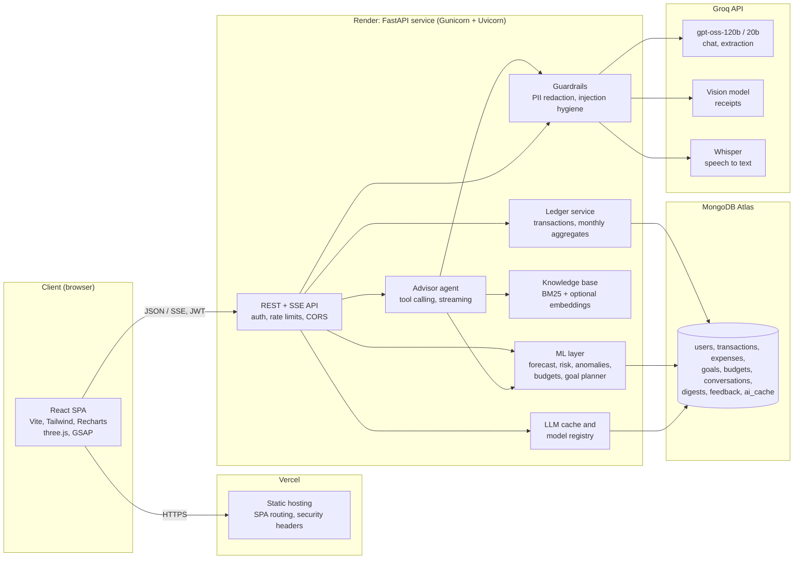
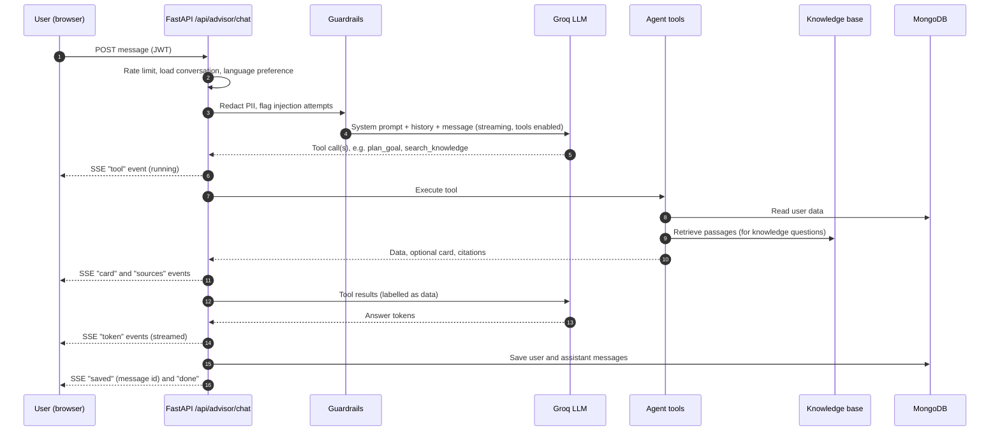
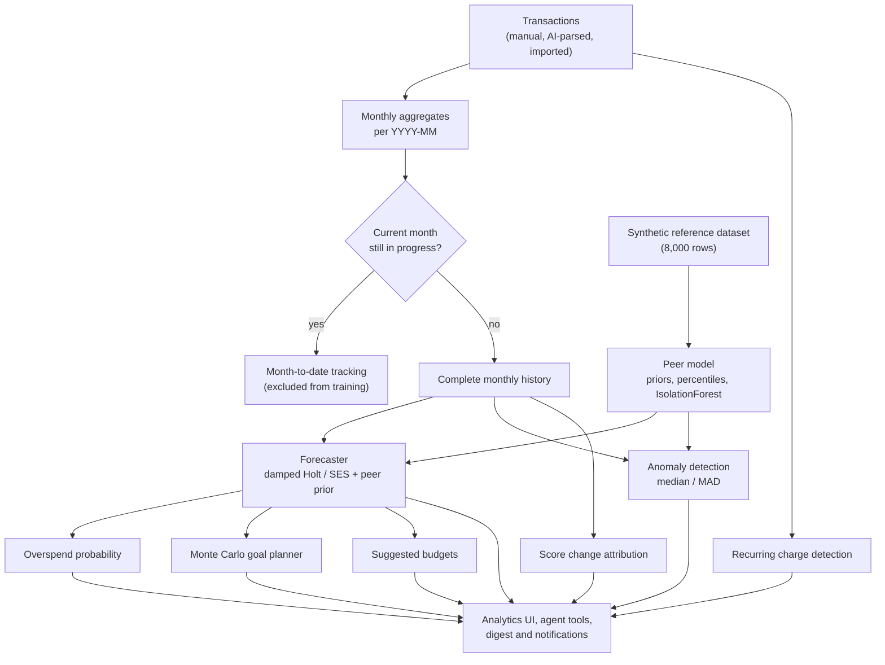
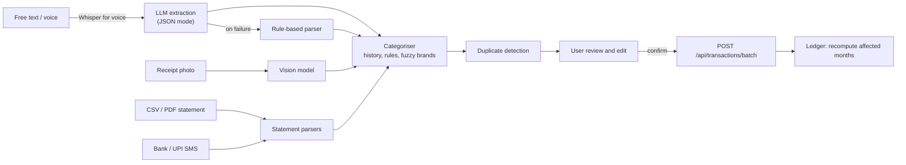

# FinSight AI

**Intelligent financial forecasting and advisory platform for personal finance in India.**

[](https://fin-sight-ai-intelligent-financial.vercel.app)
[](https://finsight-ai-k2yh.onrender.com)
[](https://github.com/ManasSaxena14/FinSight-AI-Intelligent-Financial-Forecasting-Advisory-System)
[](LICENSE)

FinSight AI is a full-stack application that turns a user's own transaction history into forecasts,
risk estimates and anomaly alerts, and pairs them with a tool-using AI advisor that explains the numbers,
cites a curated knowledge base of Indian personal-finance rules, and proposes actions the user confirms.

---

## Table of Contents

1. [Overview](#overview)
2. [Key Capabilities](#key-capabilities)
3. [System Architecture](#system-architecture)
4. [Data Model](#data-model)
5. [Machine Learning Components](#machine-learning-components)
6. [AI Advisor and Retrieval-Augmented Generation](#ai-advisor-and-retrieval-augmented-generation)
7. [Security and Privacy](#security-and-privacy)
8. [Quality and Evaluation](#quality-and-evaluation)
9. [API Reference](#api-reference)
10. [Technology Stack](#technology-stack)
11. [Project Structure](#project-structure)
12. [Getting Started](#getting-started)
13. [Configuration](#configuration)
14. [Testing and Evaluation](#testing-and-evaluation)
15. [Deployment](#deployment)
16. [Known Limitations](#known-limitations)
17. [Roadmap](#roadmap)
18. [Contributing](#contributing)
19. [License](#license)

---

## Overview

Most personal-finance tools are retrospective: they show what was spent, not what is likely to happen next.
FinSight AI is built around three principles:

- **Personal, not generic.** Forecasts and anomaly checks are computed from each user's own history. A
  synthetic reference dataset is used only for cold-start estimates and peer comparisons.
- **Numbers from models, words from the LLM.** Every figure the advisor quotes comes from a deterministic
  tool or model; the language model only explains and plans. It never does its own arithmetic.
- **Transparent and verifiable.** Forecasts carry prediction intervals and backtested accuracy, the health
  score is rule-based and explainable, every component is versioned in a model card, and knowledge-base
  answers cite their sources.

---

## Key Capabilities

### Data capture
- **Transaction ledger** with single entries, monthly totals and per-month views. Every record carries a
  `YYYY-MM` period; legacy month-name records are migrated automatically on startup.
- **Natural-language entry** in English, Hindi or Hinglish ("450 on Swiggy and 1.2k Uber yesterday").
- **Voice input** transcribed with Whisper.
- **Receipt scanning** using a vision model (merchant, date, total and line items).
- **Statement import** from CSV or PDF bank statements and pasted bank/UPI SMS messages.
- **Merchant auto-categorisation** that prefers the user's own past choices, then curated merchant rules,
  with fuzzy correction of well-known brand names.
- Every AI- or import-generated entry passes through an editable review step with duplicate detection.

### Forecasting and insights
- **Per-category spending forecasts** (1 to 12 months) with 80% prediction intervals and a rolling backtest.
- **Overspend risk** expressed as a probability, with category-level drivers.
- **Anomaly detection** against the user's own baseline, adjusted for income.
- **Explainable health score** (0 to 100) and attribution of month-over-month score changes.
- **Recurring charge and subscription detection** with expected next charge dates.
- **Suggested budgets** that reach a savings target, with month-to-date pace tracking.
- **What-if scenarios** via sliders or plain-language questions.
- **Monte Carlo goal planner** giving the probability of reaching each goal on time and the monthly
  contribution required for an 80% chance.
- **Weekly digest and proactive nudges** surfaced as notifications.

### AI advisor
- Streaming, tool-calling agent with 14 tools covering the user's data, simulations and the knowledge base.
- Retrieval-augmented answers with inline citations to sourced documents.
- Persistent, searchable conversations; replies in English, Hindi or Hinglish.
- Write actions (adding transactions, creating goals) are proposed as cards and saved only after the user
  confirms.
- Answer feedback (helpful / not helpful) recorded per message.

### User experience
- Responsive React interface with a public landing page and interactive WebGL scenes built with three.js.
- Motion design with GSAP (scroll-driven reveals, split-text headlines, route transitions), honouring the
  `prefers-reduced-motion` setting.

---

## System Architecture

### High-level architecture



### Backend layers

| Layer | Location | Responsibility |
|---|---|---|
| Routes | `backend/app/routes` | HTTP and server-sent-event endpoints, validation, authentication, rate limiting |
| Ledger | `backend/app/services/ledger.py` | Transactions as the source of truth; monthly aggregates recomputed on every change; legacy data migration; indexes |
| ML | `backend/app/ml` | Forecasting, overspend risk, anomalies, peer model, budgets, goal planner, change attribution, recurring detection, model registry |
| AI | `backend/app/ai` | LLM-based extraction with rule-based fallbacks, categorisation, statement/SMS/receipt parsing |
| Agent | `backend/app/agent` | Tool definitions and the streaming tool-calling loop |
| Retrieval | `backend/app/rag` | Curated knowledge documents, chunking, BM25 with heading boosts and acronym expansion, optional embedding search |
| Platform services | `backend/app/services` | Groq client, guardrails, rate limiting, LLM cache, feedback, conversations, digests |

### Advisor request flow



If the language model is unavailable, the agent falls back to an offline answer built from the
knowledge base and rule-based replies, so the advisor never returns an empty response.

### Insights pipeline



### Data ingestion flow



---

## Data Model

| Collection | Purpose | Key fields |
|---|---|---|
| `users` | Accounts | `email` (unique), hashed password, `language` preference |
| `transactions` | Source of truth | `user_id`, `date`, `period`, `type`, `category`, `amount`, `merchant`, `note`, `source` |
| `expenses` | Derived monthly aggregates | `user_id`, `period` (unique per user), `income`, `expenses`, `total_expense`, `savings`, `tx_count` |
| `goals` | Savings goals | `name`, `target_amount`, `target_date`, `current_savings` |
| `budgets` | Category budgets per user | `categories`, `target_rate` |
| `conversations` | Advisor chat history | `title`, `messages` (text, cards, sources, tools, feedback) |
| `digests` | Weekly digest per user and ISO week | `week`, `spent`, `summary`, `nudges` |
| `feedback` | Ratings on answers, tips and recommendations | `kind`, `key`, `rating` |
| `ai_cache` | Cached LLM narratives | `_id` (hash of the exact facts sent), `value`, `expires_at` (TTL index) |

Spending categories: Food, Travel, Rent, Shopping, Bills, Entertainment.

---

## Machine Learning Components

| Component | Method | Notes |
|---|---|---|
| Forecaster | Per-category damped Holt (6+ months of history) or simple exponential smoothing; shrunk toward a peer prior while history is short | 80% prediction intervals; rolling one-step backtest reports mean absolute percentage error and interval coverage |
| Overspend risk | P(spending > income) from the forecast's normal distribution | Category drivers show forecast versus peer median and share of uncertainty |
| Anomalies | Robust z-score (median and MAD) on income-normalised spending versus the user's own 3+ prior months | Peer percentiles and an IsolationForest mix score during cold start |
| Health score | Transparent rules: savings-rate curve minus concentration penalties | Deliberately not machine learning so each point is explainable |
| Score change attribution | Counterfactual re-scoring with one input reverted at a time | Exact attribution for each tested input |
| Goal planner | Monte Carlo simulation (4,000 paths) with month-by-month forecast savings and catch-up contributions | Goals with earlier deadlines reserve capacity first |
| Budgets | Forecast capped at the user's usual (median) level; discretionary categories trimmed first, with benchmark floors | Pace checks skip lump-sum categories such as rent |
| Recurring detection | Merchant grouping with cadence (weekly, monthly, quarterly, yearly) and amount-consistency checks | Flags subscriptions and charges that appear to have stopped |
| Peer model | Income-bracket priors, percentiles and an IsolationForest fitted once at startup | Built from a synthetic, cross-sectional dataset |

A month that is still in progress is detected and excluded from training so partial data does not
distort forecasts, anomalies or advice. The current versions of all components are exposed at
`GET /api/ml/model-info`.

---

## AI Advisor and Retrieval-Augmented Generation

### Models (Groq)

| Purpose | Default model |
|---|---|
| Chat and agent | `openai/gpt-oss-120b` (fallback `openai/gpt-oss-20b`) |
| Structured extraction | `openai/gpt-oss-20b` (JSON mode) |
| Receipt scanning | `qwen/qwen3.8-27b` (vision) |
| Voice input | `whisper-large-v3-turbo` |

All model names are configurable through environment variables.

### Agent tools

`get_financial_snapshot`, `get_monthly_history`, `get_forecast`, `search_transactions`, `search_knowledge`,
`search_past_conversations`, `run_what_if`, `list_goals`, `plan_goal`, `explain_last_change`,
`get_recurring_charges`, `suggest_budget`, `propose_transactions`, `propose_goal`.

Tools return compact data for the model, optional structured cards for the interface (charts, plans,
tables, confirmation prompts) and citations. Proposal tools never write data; the user confirms in the
interface.

### Knowledge base

Fourteen curated documents covering income-tax regimes, deductions (80C, 80D, NPS, HRA, home loans),
capital gains, EPF, PPF and NPS, mutual funds and SIPs, deposits and DICGC insurance, emergency funds,
budgeting methods, debt and credit cards, credit scores, insurance, UPI AutoPay, goal planning, and the
meaning of FinSight's own metrics. Each document records its official sources and an "as of" date.

Retrieval combines BM25 over section-sized chunks, a section-heading boost, expansion of common
acronyms (LTCG, HRA, ELSS and others) and, when `fastembed` is installed, `bge-small` embeddings merged
by reciprocal-rank fusion. The corpus is small, so the index is held in memory and built at startup.

Tax figures change with each Union Budget. The documents state the financial year they reflect, and the
advisor is instructed to recommend verification on incometax.gov.in for current figures.

---

## Security and Privacy

- **Authentication:** JWT bearer tokens; passwords hashed with bcrypt.
- **PII redaction:** PAN, Aadhaar, card and account numbers, IFSC codes, phone numbers, email addresses and
  personal UPI handles are masked before any text is sent to the language model. The user's own stored
  copy keeps the original.
- **Prompt-injection hygiene:** user-controlled text inside tool results (merchant names, notes, earlier
  conversations) is labelled as data, and instruction-like phrases are neutralised.
- **Advice boundaries:** the advisor does not recommend specific stocks, funds or cryptocurrencies, and
  declines unrelated tasks.
- **Rate limiting:** per-user limits on AI endpoints and per-IP limits on login and registration.
- **Strict production startup:** with `ENV=production` the service refuses to start with a weak JWT
  secret, debug mode, wildcard CORS origins or a missing API key.
- **Transport and headers:** CORS restricted to configured origins; the frontend sets HSTS,
  `X-Content-Type-Options`, `X-Frame-Options`, `Referrer-Policy` and a `Permissions-Policy` that allows
  the microphone only on the application's own origin.
- **Uploads:** statement and receipt files are parsed in memory and not stored; size limits apply.

---

## Quality and Evaluation

| Check | Scope | Result |
|---|---|---|
| Backend test suite | 92 tests; in-memory database, no network | All passing |
| Retrieval evaluation (CI gate) | 30 questions mapped to expected documents | hit@1 96.7%, hit@3 100%, MRR 0.98 |
| Live advisor evaluation | 16 scenarios: tool use, citations, proposals, refusals, prompt injection, off-topic handling, Hindi and Hinglish replies | 16 of 16 after fixes (run with real model calls) |
| Forecast backtest | Rolling one-step backtest on each user's history | Shown in the Analytics model transparency panel |
| Frontend | ESLint and production build | Clean |

The live evaluation calls the real model and is not part of CI; run it before releases.

---

## API Reference

All endpoints except authentication require `Authorization: Bearer <token>`. Interactive documentation
is available at `/docs` when the backend is running.

| Area | Method and path | Description |
|---|---|---|
| Health | `GET /`, `GET /api/health` | Liveness and database readiness |
| Auth | `POST /api/auth/register`, `POST /api/auth/login`, `GET /api/auth/me` | Account management |
| Monthly records | `POST /api/expenses/add`, `GET /api/expenses/get` | Monthly totals and records |
| Transactions | `POST /api/transactions`, `POST /api/transactions/batch`, `GET /api/transactions`, `DELETE /api/transactions/{id}` | Ledger entries; batch confirm for AI and import proposals |
| ML | `GET /api/ml/insights`, `POST /api/ml/health-score`, `GET /api/ml/model-info` | Forecast, risk, anomalies, benchmarks; model card |
| Goals | `POST/GET /api/premium/goals`, `PUT /api/premium/goals/{id}/contribute`, `DELETE /api/premium/goals/{id}` | Savings goals |
| Planning | `POST /api/premium/scenario`, `GET /api/premium/smart-savings`, `GET /api/premium/budget-live` | Scenarios and savings tips |
| Summaries | `POST /api/premium/summary`, `GET /api/premium/notifications` | AI monthly summary and notifications |
| Advisor | `POST /api/advisor/chat` (SSE), `GET/PATCH/DELETE /api/advisor/conversations/...`, `POST /api/advisor/feedback`, `POST /api/advisor/transcribe`, `GET /api/advisor/suggestions` | Agent chat and conversations |
| Smart input | `POST /api/ai/parse`, `GET /api/ai/categorize`, `POST /api/ai/import`, `POST /api/ai/receipt` | Proposals for review (never saved directly) |
| Insights | `POST /api/ai/what-if`, `GET /api/ai/explain-change`, `GET /api/ai/recurring`, `GET /api/ai/goals/{id}/plan` | Scenarios, attribution, subscriptions, goal simulation |
| Budgets | `GET /api/ai/budgets/suggest`, `GET /api/ai/budgets`, `PUT /api/ai/budgets` | Suggested and saved budgets with progress |
| Digest | `GET /api/ai/digest`, `POST /api/ai/digests/run` (scheduler secret) | Weekly digest |
| Feedback and preferences | `POST /api/ai/feedback`, `POST /api/ai/feedback/reset`, `GET/PUT /api/ai/preferences` | Ratings and reply language |

Legacy endpoints `POST /api/premium/chat` and `POST /api/premium/chat/stream` remain available for
backward compatibility.

---

## Technology Stack

| Area | Technologies |
|---|---|
| Frontend | React 19, Vite, Tailwind CSS 4, React Router, Recharts, three.js, GSAP (ScrollTrigger, SplitText, DrawSVG), Axios, lucide-react |
| Backend | Python 3.14, FastAPI, Pydantic, Motor (async MongoDB), Gunicorn with Uvicorn workers |
| Machine learning | NumPy, pandas, scikit-learn, SciPy |
| AI | Groq API (gpt-oss, Qwen vision, Whisper), optional fastembed for embeddings |
| Documents | pypdf |
| Data | MongoDB Atlas |
| Authentication | JWT (python-jose), bcrypt (passlib) |
| Testing and CI | pytest, httpx, ESLint, GitHub Actions |
| Hosting | Vercel (frontend), Render or Docker (backend) |

---

## Project Structure

```
.
├── frontend/
│   ├── src/
│   │   ├── pages/              Landing, Login, Register, Dashboard, AddExpense, Analytics,
│   │   │                       Advisor, Goals, HowItWorks, Profile, Plans
│   │   ├── components/         UI kit, layout, advisor chat and cards, smart input,
│   │   │                       insight panels, goal planner, model card
│   │   ├── three/              WebGL scenes (hero, AI core, spending skyline, ambient field)
│   │   ├── api/                API clients, including the SSE stream helper
│   │   └── lib/                Formatting and motion utilities
│   ├── vercel.json             SPA routing, caching and security headers
│   └── .env.example
├── backend/
│   ├── app/
│   │   ├── routes/             auth, expenses and transactions, ml, premium, advisor, ai
│   │   ├── ml/                 forecasting, risk, anomaly, population, insights, budgets,
│   │   │                       goal_planner, explain, recurring, registry
│   │   ├── agent/              tools.py, runner.py
│   │   ├── rag/                knowledge/ (curated Markdown), knowledge_base.py, search.py
│   │   ├── ai/                 extract.py, categorize.py, parsers.py
│   │   ├── services/           ledger, llm, guardrails, rate_limit, ai_cache, ai_insights,
│   │   │                       conversations, feedback, advisor, financial_logic, auth
│   │   ├── models/             Pydantic schemas
│   │   ├── config.py, db.py, main.py
│   ├── data/                   Synthetic reference dataset
│   ├── tests/                  Offline pytest suite
│   ├── evals/                  Retrieval and live advisor evaluation sets
│   ├── requirements.txt        Pinned runtime dependencies
│   ├── requirements-dev.txt    Test dependencies
│   ├── requirements-rag.txt    Optional embedding search
│   ├── Dockerfile, gunicorn.conf.py, .env.example
├── .github/workflows/ci.yml
├── render.yaml
├── DEPLOYMENT.md
└── LICENSE
```

---

## Getting Started

### Prerequisites

- Python 3.14 (see `.python-version`)
- Node.js 22
- MongoDB (Atlas or a local instance)
- A Groq API key (the application runs without one, using rule-based fallbacks)

### Backend

```bash
cd backend
python -m venv venv
source venv/bin/activate            # Windows: venv\Scripts\activate
pip install -r requirements-dev.txt # or requirements-rag.txt to enable embedding search
cp .env.example .env                # set MONGODB_URI, GROQ_API_KEY, JWT_SECRET_KEY
uvicorn app.main:app --reload
```

The API starts on `http://127.0.0.1:8000`; documentation is at `/docs`.

### Run both (backend first)

```bash
./scripts/dev.sh
```

Starts the API, waits until `/api/health` reports healthy (database connected), and only then starts the
frontend. In production the browser enforces the same order: the app does not load until the backend answers
(see [DEPLOYMENT.md](DEPLOYMENT.md#backend-first-startup)).

### Frontend only

```bash
cd frontend
npm install
npm run dev
```

The application starts on `http://localhost:5173`. In development, requests to `/api` are proxied to the
backend, so no frontend environment variables are required.

---

## Configuration

Backend settings are read from environment variables or `backend/.env`. See `backend/.env.example`.

| Variable | Required | Default | Description |
|---|---|---|---|
| `MONGODB_URI` | Yes | `mongodb://localhost:27017` | MongoDB connection string |
| `DATABASE_NAME` | No | `finsight_ai` | Database name |
| `JWT_SECRET_KEY` | Yes (production) | none | 32+ character random secret |
| `JWT_EXPIRATION_MINUTES` | No | `60` | Session length |
| `ENV` | No | `development` | `production` enables strict startup checks |
| `ALLOWED_ORIGINS` | Yes (production) | local and project origins | JSON list of allowed frontend origins |
| `GROQ_API_KEY` | Yes (production) | none | Groq API key |
| `GROQ_CHAT_MODEL`, `GROQ_FAST_MODEL`, `GROQ_VISION_MODEL`, `GROQ_SPEECH_MODEL` | No | see above | Model selection |
| `RATE_LIMITS_ENABLED` | No | `true` | Per-user and per-IP rate limits |
| `DIGEST_CRON_SECRET` | No | none | Enables the scheduled digest endpoint |
| `FINSIGHT_DISABLE_EMBEDDINGS` | No | unset | Forces lexical-only retrieval |

Frontend: `VITE_API_URL` (production only), for example `https://your-api.onrender.com/api`.

---

## Testing and Evaluation

```bash
cd backend
python -m pytest tests               # unit, API and retrieval quality tests (offline)
python -m evals.run_advisor_eval     # live advisor evaluation (requires GROQ_API_KEY)

cd ../frontend
npm run lint
npm run build
```

Continuous integration (`.github/workflows/ci.yml`) runs the backend test suite and the frontend lint and
build on every push and pull request.

---

## Deployment

The recommended setup is MongoDB Atlas, the backend on Render using the `render.yaml` blueprint, and the
frontend on Vercel. A Dockerfile is provided for other hosts. [DEPLOYMENT.md](DEPLOYMENT.md) covers:
- environment variables
- the one-time migration of legacy records (take a database backup first)
- memory guidance for embedding search
- scheduling weekly digests
- post-deployment verification

---

## Known Limitations

- The reference dataset is synthetic and cross-sectional. It is used only for cold-start estimates and
  peer comparisons, not for personal forecasts once history exists.
- Seasonality is not modelled; reliable seasonal estimates require roughly two years of history per user.
- Rate limits are held in memory and therefore apply per instance; use a shared store such as Redis when
  running multiple instances.
- PDF statement layouts vary by bank; CSV export is the more reliable import path.
- Knowledge-base tax figures reflect the financial year stated in each document and must be reviewed after
  each Union Budget.
- Semantic (embedding) search requires roughly 250 MB of additional memory.

---

## Roadmap

- [x] Receipt scanning and bank statement / UPI SMS import
- [x] Tool-using advisor with retrieval-augmented answers
- [ ] Account Aggregator integration for consent-based automatic bank syncing
- [ ] Shared household budgets with multiple members
- [ ] Portfolio tracking for mutual funds and equities
- [ ] Email and push delivery of the weekly digest
- [ ] Shared rate-limit and cache store for horizontal scaling

---

## Contributing

1. Fork the repository and create a feature branch (`git checkout -b feature/your-change`).
2. Make your change with tests where applicable.
3. Run `python -m pytest tests` in `backend` and `npm run lint && npm run build` in `frontend`.
4. Open a pull request describing the change and its motivation.

---

## License

Distributed under the MIT License. See [LICENSE](LICENSE).

---

## Author

Developed by [Manas Saxena](https://github.com/ManasSaxena14).

FinSight AI is an educational tool and does not provide investment, tax or legal advice.
